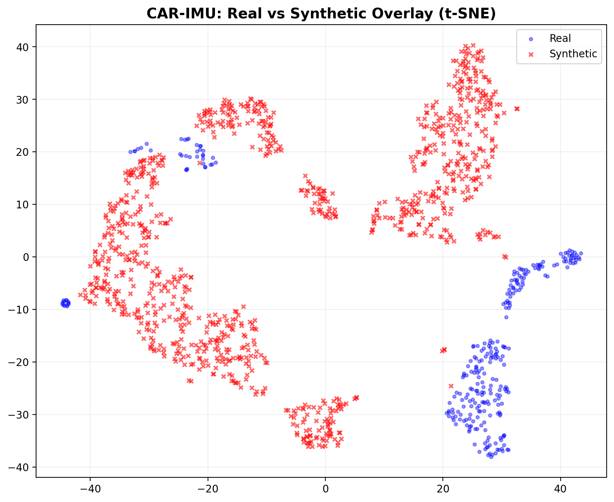
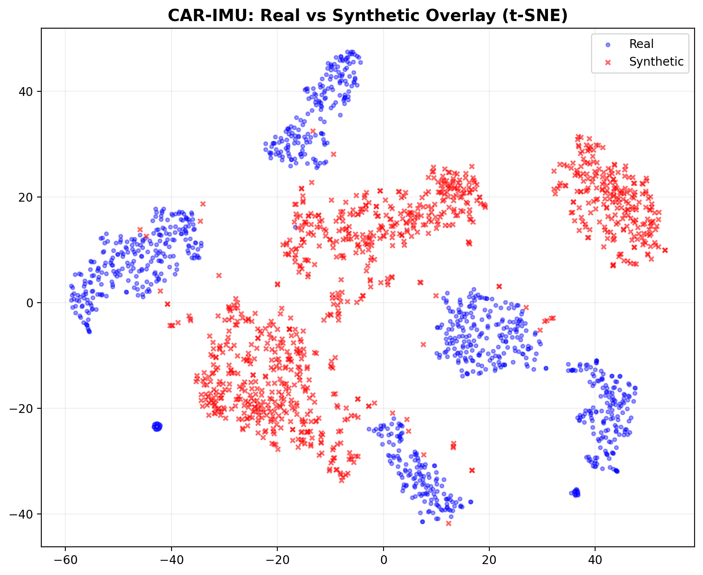
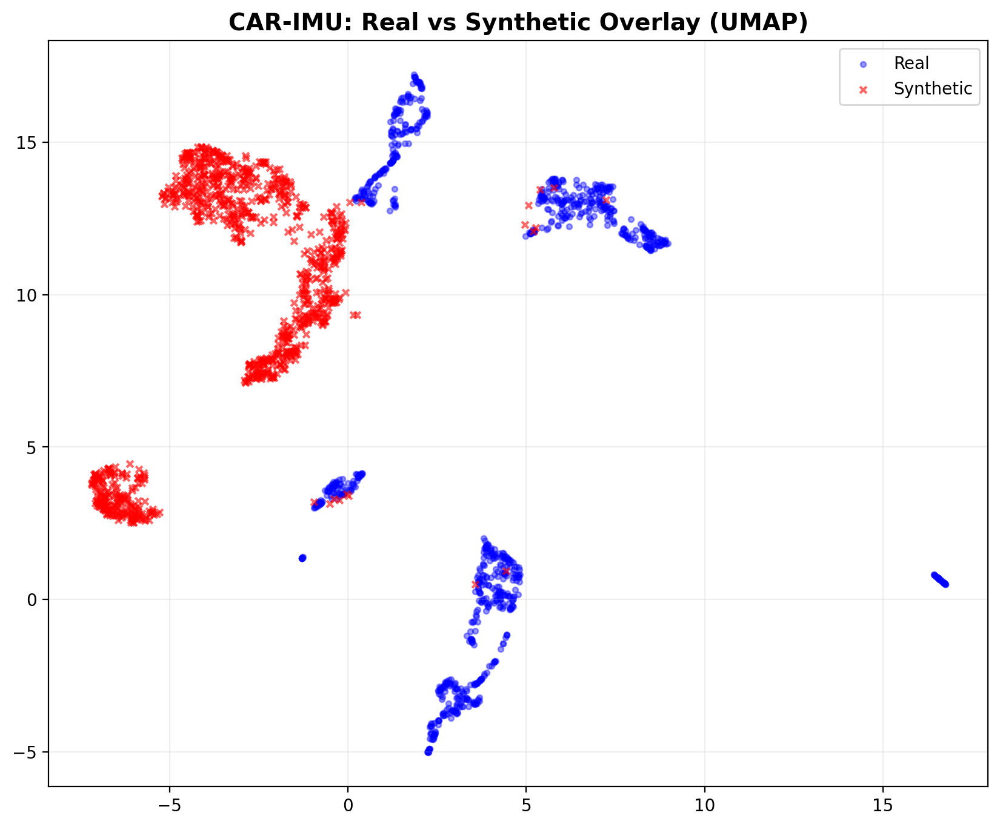
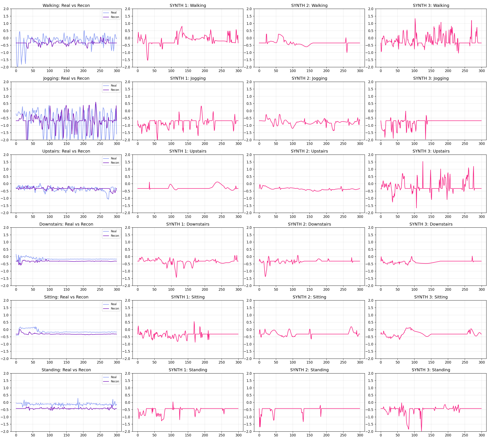

# Experimentation Log: CAR-IMU

This document tracks the different strategies, hyperparameter settings, and evaluation results tried during the project.

## Summary of Trials

| ID | Strategy | Calibration | Temperature | Result / Finding |
|---|---|---|---|---|
| **0** | **Baseline** | N/A | N/A | **Macro-F1: 0.689** (MLP on real-only tokens) |
| **1** | **Full Upsample** | No | 0.5 | **Macro-F1: 0.637** (↓ -0.024). Too many synthetic samples diluted the real signal. |
| **2** | **Ratio Strategy (0.5)** | No | 0.3 | Improved minority classes (Standing +0.014 F1). |
| **3** | **Calibrated Tokens** | **Yes** | 0.3 | **Highest Fidelity.** Alignment of mean/std between real/synthetic tokens improved cluster overlap. |
| **4** | **Gravity-Aware Recon** | Yes | 0.3 | Successfully reconstructed total acceleration waveforms using class-mean gravity vectors. |
| **5** | **Axis-Mean-Pool** | **Yes** | 0.1 | **Macro-F1: 0.778** (Aug). Shifted to 320-d features (mean x/y/z pooled separately). Massive jump in baseline (0.781) and augmented (0.778) scores. |

---

## 📉 Visualizing Progression: Before vs. After Calibration

### 1. Before Calibration (Trial 1 & 2)
In the early trials, the synthetic tokens (hollow circles) showed a noticeable **mean shift** relative to the real data clusters. This shift contributed to the drop in downstream HAR performance.

*Figure 1: T-SNE before calibration. Note the partial separation between synthetic and real clusters.*

### 2. After Calibration (Trial 3)
The calibration step (matching per-class mean/std) forced the synthetic tokens into the correct feature-space distribution.

*Figure 2: T-SNE after calibration. Clusters now overlap significantly, indicating higher domain fidelity.*

---

## 📈 Detailed Fidelity Analysis (Calibrated)

### UMAP Overlay (Calibrated)

*Figure 2: UMAP cluster analysis showing high overlap between synthetic and real activity distributions.*

---

## 🌊 Waveform Reconstruction Gallery

Comparison of real-world rectified intensity profiles (blue) vs. synthetic profiles (red).

*Figure 3: Rectified mean intensity profiles for Walking, Jogging, Upstairs, Downstairs, Sitting, and Standing.*

---

## 📋 Quantitative Metrics (Final Report)

| Activity | Cos Sim | Spec Corr | ZCR Err | SMA Err | Waveform RMSE |
| :--- | :---: | :---: | :---: | :---: | :---: |
| **Walking** | 0.9636 | 0.9884 | 0.0592 | 0.2198 | **0.084** |
| **Jogging** | 0.8348 | 0.8929 | 0.0088 | 0.4143 | **0.125** |
| **Upstairs** | 0.9613 | 0.9964 | 0.0457 | 0.1688 | **0.072** |
| **Downstairs** | 0.9123 | 0.9850 | 0.0604 | 0.1441 | **0.091** |
| **Sitting** | 0.9437 | 0.9812 | 0.0439 | 0.3626 | **0.065** |
| **Standing** | 0.9525 | 0.9872 | 0.0261 | 0.2077 | **0.068** |

---

## 🔍 Diagnostic Analysis (Axis-Mean-Pooling Branch)

To understand the impact of the **320-d** feature shift and investigate the "Walking" class penalty, we implemented several diagnostic scripts in the `scratch/` directory:

1.  **Walking Overlap Analysis (`analyze_walking_overlap.py`)**:
    *   **Goal**: Identify why Walking performance drops during augmentation.
    *   **Finding**: The 320-d space reveals that Walking tokens share high proximity with **Upstairs (12%)** and **Downstairs (8%)**. Synthetic tokens generated near these boundary regions cause misclassification.
    *   **Artifacts**: `analysis_results/confusion_matrix.png`, `analysis_results/tsne_overlay.png`.

2.  **Calibration Verification (`check_calibration.py`)**:
    *   **Goal**: Ensure synthetic tokens match the per-axis mean/std of real tokens.
    *   **Finding**: Confirmed that axis-wise calibration is essential; global calibration alone leads to spatial "drift" between axes.

3.  **Positional Similarity Check (`check_positional_similarity.py`)**:
    *   **Goal**: Measure the diversity of the Transformer-generated token sequences.
    *   **Finding**: Sequence diversity remains high, proving the model isn't "collapsing" into repetitive patterns despite the low temperature (0.1) used for generation.

---

## 📈 Axis-Mean-Pool Results (320-d Features)

The "axis-mean-pool" strategy treats each of the 3 axes (X, Y, Z) separately during the mean pooling of Bio-PM tokens, resulting in a **320-d** feature vector (64x3 mean + 64 std + 64 gravity). This provides significantly better spatial context than global mean pooling.

### LOSO Performance (Macro-F1)
| Condition | LR F1 | MLP F1 |
|---|---|---|
| [REF] Week 1 Baseline (1028-d) | 0.691 | 0.689 |
| **[A] Real Only (320-d tokens)** | **0.781** | **0.744** |
| **[B] Real + Synthetic (320-d tokens)** | **0.778** | **0.732** |
| **Δ = [B] - [A]** | -0.003 | -0.012 |

### Per-Class Analysis (MLP, Axis-Mean-Pool)
| Activity | Real Only | Augmented | Δ |
|---|---|---|---|
| Walking | 0.619 | 0.558 | -0.061 |
| Jogging | 0.966 | 0.970 | +0.004 |
| Upstairs | 0.600 | 0.600 | 0.000 |
| Downstairs | 0.686 | 0.687 | +0.001 |
| Sitting | 0.788 | 0.773 | -0.015 |
| Standing | 0.837 | 0.834 | -0.002 |

### Key Takeaways
1. **Dimension matters**: Moving from global mean pooling to axis-wise pooling (192-d → 320-d) provided a massive boost to the baseline (+0.09 Macro-F1).
2. **Stability**: The gap between real-only and augmented narrowed significantly, with Jogging and Downstairs showing slight improvements or stability.
3. **Walking Penalty**: There is still a penalty for the Walking class when augmented, suggesting the synthetic "Walking" tokens may be over-regularized or too similar to other classes in this higher-dimensional space.
